# Dependabot Analyzer - Architecture & Data Flow

```mermaid
graph TB
    User[User CLI Command] --> Orchestrator[DependabotAnalyzer<br/>Orchestrator]

    subgraph "GitHub API Integration"
        GH[GitHub API<br/>Dependabot Alerts]
        Repo[GitHub Repository<br/>Code Files]
    end

    subgraph "Agent Layer"
        AlertFetcher[AlertFetcher Agent<br/>Fetches alerts & code context]
        CodeAnalyzer[CodeAnalyzer Agent<br/>Pattern matching & search]
        DeepAnalyzer[DeepAnalyzer Agent<br/>LLM-powered analysis]
        ReflectionAgent[ReflectionAgent<br/>Quality assessment & routing]
        FPChecker[FalsePositiveChecker Agent<br/>LLM validation]
    end

    subgraph "LLM Provider (Google AI Studio)"
        Gemini[Gemini API<br/>gemini-flash-latest]
    end

    subgraph "Output"
        Reports[Analysis Reports<br/>JSON files]
        Console[Rich Console<br/>Terminal UI]
    end

    %% Workflow sequence
    Orchestrator -->|1. Fetch alerts| AlertFetcher
    AlertFetcher -->|GET /repos/:owner/:repo/dependabot/alerts| GH
    GH -->|Dependabot alerts list| AlertFetcher
    AlertFetcher -->|Get manifest & code files| Repo
    Repo -->|Code context| AlertFetcher
    AlertFetcher -->|DependabotAlert objects| Orchestrator

    Orchestrator -->|2. Search vulnerable patterns| CodeAnalyzer
    CodeAnalyzer -->|Fetch code files| Repo
    Repo -->|Source code| CodeAnalyzer
    CodeAnalyzer -->|CodeMatch objects<br/>Regex pattern matches| Orchestrator

    Orchestrator -->|3. Deep analysis| DeepAnalyzer
    DeepAnalyzer -->|Structured prompt<br/>Alert + Code + Matches| Gemini
    Gemini -->|JSON response<br/>Exploitability assessment| DeepAnalyzer
    DeepAnalyzer -->|AnalysisReport| Orchestrator

    Orchestrator -->|4. Quality check| ReflectionAgent
    ReflectionAgent -->|Reflection prompt<br/>Report + History| Gemini
    Gemini -->|JSON response<br/>Quality assessment + Command| ReflectionAgent
    ReflectionAgent -->|ReflectionResult + Command| Orchestrator
    Orchestrator -->|If retry command| DeepAnalyzer

    Orchestrator -->|5. Validate findings<br/>Only if exploitable| FPChecker
    FPChecker -->|Critical validation prompt<br/>Report + Evidence| Gemini
    Gemini -->|JSON response<br/>False positive assessment| FPChecker
    FPChecker -->|FalsePositiveCheck<br/>Corrected report| Orchestrator

    Orchestrator -->|Display results| Console
    Orchestrator -->|Save JSON| Reports

    %% Styling
    classDef agentClass fill:#e1f5ff,stroke:#0066cc,stroke-width:2px
    classDef githubClass fill:#f0f0f0,stroke:#333,stroke-width:2px
    classDef llmClass fill:#fff4e6,stroke:#ff9800,stroke-width:2px
    classDef outputClass fill:#e8f5e9,stroke:#4caf50,stroke-width:2px

    class AlertFetcher,CodeAnalyzer,DeepAnalyzer,ReflectionAgent,FPChecker agentClass
    class GH,Repo githubClass
    class Gemini llmClass
    class Reports,Console outputClass
```



## Agent Interaction Flow

### 1. **AlertFetcher Agent** (GitHub Integration)
- **Purpose**: Fetches Dependabot security alerts and code context
- **Interactions**:
  - → GitHub API: `GET /repos/:owner/:repo/dependabot/alerts`
  - → GitHub Repository: Reads manifest files and source code
  - ← Returns: `DependabotAlert` objects with vulnerability details

### 2. **CodeAnalyzer Agent** (Pattern Matching)
- **Purpose**: Searches codebase for actual vulnerable function usage
- **Interactions**:
  - → GitHub Repository: Scans source files (up to 50 files)
  - → Uses regex patterns to find vulnerable code
  - ← Returns: `CodeMatch` objects with file paths, line numbers, and code snippets
- **Intelligence**:
  - Pre-defined vulnerability patterns (e.g., axios GHSA patterns)
  - Filters out test files and comments
  - Provides contextual code surrounding matches

### 3. **DeepAnalyzer Agent** (LLM-Powered)
- **Purpose**: Performs deep exploitability analysis using AI reasoning
- **Interactions**:
  - → Gemini API (via Google AI Studio): Sends structured prompt
  - → Receives: Alert details + Code context + Code matches
  - ← Returns: `AnalysisReport` with exploitability assessment
- **LLM Output**:
  - `is_exploitable`: boolean
  - `confidence`: high/medium/low
  - `reasoning`: detailed explanation
  - `impact_assessment`: security impact
  - `priority`: critical/high/medium/low
  - `recommended_action`: next steps

### 4. **ReflectionAgent** (Quality Assessment - Phase 2)
- **Purpose**: Meta-analysis of result quality with dynamic workflow routing
- **Interactions**:
  - → Gemini API: Sends reflection prompt with analysis history
  - → Reviews confidence, detects patterns, suggests improvements
  - ← Returns: `ReflectionResult` with assessment and routing command
- **Commands**:
  - `accept_result`: Proceed to next phase
  - `retry_analysis`: Loop back to DeepAnalyzer with refined context
  - `search_more_code`: Request additional code search (future)
  - `escalate_manual`: Flag for human review
- **Pattern Detection**:
  - Identifies: package_imported_not_used, only_in_tests, contradictory_reasoning, etc.
  - Max 2 refinement iterations per alert

### 5. **FalsePositiveChecker Agent** (LLM Validation)
- **Purpose**: Critically validates findings to reduce false positives
- **Interactions**:
  - → Gemini API: Sends skeptical validation prompt
  - → Only runs if alert is flagged as exploitable
  - ← Returns: `FalsePositiveCheck` with corrections
- **LLM Validation**:
  - Checks if matches are in test code only
  - Verifies user input can reach vulnerable code
  - Identifies over-inflated severity
  - Corrects priority and exploitability if needed

### 6. **DependabotAnalyzer** (Orchestrator)
- **Purpose**: Coordinates the entire workflow with adaptive routing
- **Workflow**:
  1. Fetch alerts (AlertFetcher)
  2. Search for vulnerable patterns (CodeAnalyzer)
  3. Deep analysis loop (up to 3 attempts):
     - DeepAnalyzer → Gemini
     - ReflectionAgent → Gemini (up to 2 iterations)
     - If reflection suggests retry: loop back to DeepAnalyzer with refined context
  4. False positive check (FPChecker → Gemini) - only if exploitable
  5. Apply corrections and generate reports
  6. Display summary and save to JSON

## Data Flow Summary

```
GitHub Alerts → AlertFetcher → DependabotAlert[]
                     ↓
GitHub Code → CodeAnalyzer → CodeMatch[]
                     ↓
     [Alert + Code + Matches] → DeepAnalyzer → Gemini API
                     ↓
              AnalysisReport
                     ↓
     [Report + History] → ReflectionAgent → Gemini API
                     ↓
              ReflectionResult + Command
                     ↓
         (if retry: loop back to DeepAnalyzer with context)
                     ↓
              AnalysisReport (final, if exploitable)
                     ↓
     [Report + Matches] → FalsePositiveChecker → Gemini API
                     ↓
         FalsePositiveCheck + Corrected Report
                     ↓
              JSON Reports + Console Output
```

## Key Technologies

- **GitHub API**: PyGithub library for REST API access
- **LLM Provider**: Google AI Studio (Gemini 2.0 Flash)
- **UI**: Rich library for terminal formatting
- **Data Models**: Pydantic for structured data validation
- **Orchestration**: Async/await for concurrent operations
